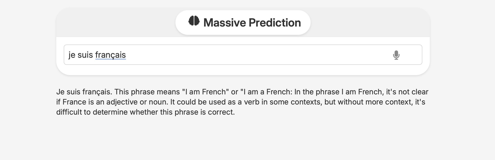

# Massive Prediction (AtomicSearch Engine)

**Massive Prediction** is an AI search engine that lets you quickly search queries such as `is this cafe good`, `are these habits beneficial for productivity` or `pharmacies near me`, etc.



## History

This project is a fork of Victor Nogueira's MiniSearch (`felladrin/minisearch`). AtomicSearch adds other features such as instant search results, type-and-see, payment gateways, optional premium (behind paywall) features, waiting list, specific LLM and speed optimization, and specific configurations for the specific needs of Atomic Search's specifications. The core project is currently still strongly based on Victor Nogueira's wonderful project as a way to bootstrap the project quicker. Although this might change in the future when Massive Prediction takes a different path in the way the project wants to deliver the information.

## Features

- **Privacy-focused**: [No tracking, no ads, no data collection](https://docs.searxng.org/own-instance.html#how-does-searxng-protect-privacy)
- **Easy to use**: Minimalist yet intuitive interface for all users
- **Cross-platform**: Models run inside the browser, both on desktop and mobile
- **Integrated**: Search from the browser address bar by setting it as the default search engine
- **Time-saver**: AI responses enhanced with search results
- **Efficient**: Models are loaded and cached only when needed
- **Optimized**: Aims for the balance between size and performance
- **Open-source**: [The code is available for inspection and contribution at GitHub](https://github.com/felladrin/MiniSearch)
- **Anonymous**: All queries go anonymously to the determined search engine. Nothing else leaves your device.
- **AI-powered**: The AI analyses the results, comments on them, and responds by summarising the information.

## Prerequisites

- [Docker](https://docs.docker.com/get-docker/)

Then, open http://localhost:7860 in your browser and start searching!

## Building and running from source

You can build and run it from the source if you don't want to use AtomicSearch's Docker Image. For that, clone this repository and run the following command:

```bash
docker-compose -f docker-compose.production.yml up --build
```

## Rebuild docker containers

```console
docker-compose down
docker-compose build
docker-compose up
```

## Testing / Running project on your machine (through Docker Image)

```console
docker pull ghcr.io/atomicsearch/ai-search-engine:main
```

## Shoutouts

The foundation of the search engine is based on Victor Nogueira's open-source work. **AtomicSearch (AKA Massive Prediction)** is a fork of **MiniSearch**, a similar AI search engine but with different goals and usage.
